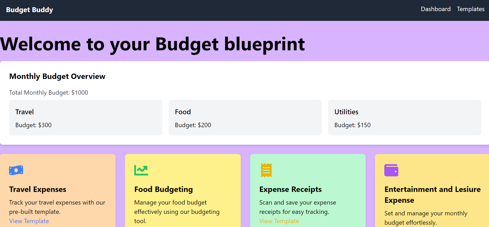

### Problem Statement :  Money Management for Young Adults

Young adults (aged 18-25) are financially savvy but lack the tools and guidance to confidently navigate their financial futures.
Design an inclusive FinTech solution that empowers them to manage their money effectively and build a secure financial foundation.

### Solution?

# Budget Buddy 
## Empower your finances , simplify your life


Our solution aims to tackle the common challenge faced by young adults: managing finances confidently. Through our user-friendly website, we provide templates to track spending in various categories like travel and rent etc. Users set monthly budgets and allocate funds accordingly.  By addressing this gap in financial guidance, we empower young adults to navigate their financial futures with ease, building a secure foundation for themselves.


## Features

- Simple and User friendly UI

- In app wallet for recording trancastion history 

- Templates designed keeping  young adults in mind

- Transparent transactions making the user conscious about spending money

### Tech Stack
This is a web application for now  built using the following technologies:
1. React 
2. React DOM 
3. TailwindCSS 
4. Google's Firebase (for backend)
5. Expo Router (for routing)
6. Node JS 
7. Javascript
8. Firestore Database ( switch to MongoDB at later stage for scalibility issues) 
9. Figma ( for wireframing and designing )
10. Vercel / Stellar blockchain ( for deployment)
    


## Some snippets of Budget Buddy:

    

  

  


## Testing
1. Clone this repository
```
git clone https://github.com/ArshTiwari2004/CodeCubicle
```
2. Install node dependencies
```
cd Money-Mentor && npm install
```
3. Run the server
```
npm run dev
```

#### License
[MIT](https://choosealicense.com/licenses/mit/)
