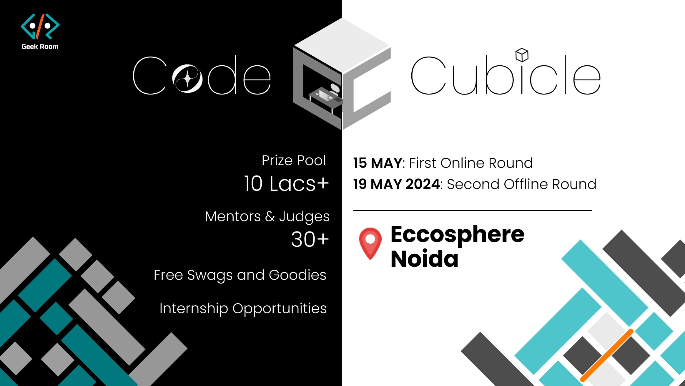

# CODE CUBICLE HACKATHON 

## 15-19 May | Geek Room




## Team - Hola Amigo

## Team Members :
1. Arsh Tiwari
2. Nibedan Pati 
3. Utsav Jana
4. Srijan Gupta 

### Theme : FinTech

### Problem Statement :  Money Management for Young Adults

Young adults (aged 18-25) are financially savvy but lack the tools and guidance to confidently navigate their financial futures.
Design an inclusive FinTech solution that empowers them to manage their money effectively and build a secure financial foundation.

### What we have built?

## Budget Buddy

Our solution aims to tackle the common challenge faced by young adults: managing finances confidently. Through our user-friendly website, we provide templates to track spending in various categories like travel and rent etc. Users set monthly budgets and allocate funds accordingly.  By addressing this gap in financial guidance, we empower young adults to navigate their financial futures with ease, building a secure foundation for themselves.


## Features

- Simple and User friendly UI

- In app wallet for recording trancastion history 

- Templates designed keeping  young adults in mind

- Transparent transactions making the user conscious about spending money

## Some snippets of Budget Buddy:


## Local Host Testing

To test this project run

```bash
  npm run dev
```
#### License
[MIT](https://choosealicense.com/licenses/mit/)
